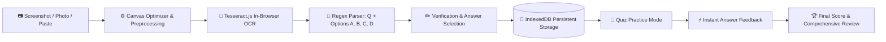

# 📝 MCQ Practice — Personal Exam Practice & In-Browser OCR Engine

<p align="center">
  
  
  
  
  
  
</p>

A clean, modern, and mobile-friendly web application designed for students and professionals to practice exam questions seamlessly. 

The entire application is built around a single, highly optimized workflow:
> **Upload Screenshot → Extract with OCR → Edit / Verify → Save Locally → Practice Anywhere**

---

## 📑 Table of Contents

- [Key Highlights](#-key-highlights)
- [System Architecture & Core Workflow](#-system-architecture--core-workflow)
- [Detailed Features](#-detailed-features)
  - [1. In-Browser OCR & Fast Question Entry](#1-in-browser-ocr--fast-question-entry)
  - [2. Flexible Question Types (Single & Multi-Select)](#2-flexible-question-types-single--multi-select)
  - [3. Interactive Practice with Instant Solution Reveal](#3-interactive-practice-with-instant-solution-reveal)
  - [4. Resilient Local Storage & 1-Click Backup / Restore](#4-resilient-local-storage--1-click-backup--restore)
  - [5. Detailed Performance Analytics & Answer Review](#5-detailed-performance-analytics--answer-review)
  - [6. Mobile-First UI & Ambient Dark Mode](#6-mobile-first-ui--ambient-dark-mode)
- [Quick Start](#-quick-start)
- [File & Project Structure](#-file--project-structure)
- [Privacy & Security](#-privacy--security)
- [Browser Compatibility](#-browser-compatibility)

---

## ⚡ Key Highlights

- **Zero Backend / Serverless**: No cloud databases, no user accounts, no login required.
- **Client-Side AI/OCR**: Optical Character Recognition runs entirely inside the user's browser using WebAssembly.
- **Clipboard & Mobile Camera Native**: Paste screenshots directly with `Ctrl + V` or snap questions on your phone.
- **Persistent Storage**: Utilizes browser **IndexedDB** with storage persistence protection (`navigator.storage.persist`).
- **Data Portability**: Complete 1-click **JSON Backup & Restore** for disaster recovery and cross-device migration.

---

## 🔄 System Architecture & Core Workflow



---

## 🚀 Detailed Features

### 1. In-Browser OCR & Fast Question Entry
- **Image Input Flexibility**:
  - Drag-and-drop screenshots directly into the dropzone.
  - Native clipboard support (`Ctrl + V`) to paste captured screenshots instantly.
  - Direct camera / photo library integration on mobile devices.
- **Canvas-Assisted Preprocessing**: Automatically downscales oversized camera images (up to 4K) to an optimal resolution with contrast normalization to ensure fast recognition without memory stalls.
- **Heuristic Parsing**: Parses arbitrary screenshot text formats (`A.`, `(A)`, `1.`, `Ans: B`) into Question and Options A, B, C, and D automatically.
- **Rapid Adding Flow**: Confirmation toast with a direct `+ Add Another Question` button allows you to input dozens of questions in minutes.

### 2. Flexible Question Types (Single & Multi-Select)
- **Single Answer (Radio Buttons)**:
  - Indicated with `○ Single Answer (Radio)` pill.
  - Traditional single-choice MCQs with circular radio button selectors.
- **Multiple Answers (Checkboxes)**:
  - Indicated with `☑ Multiple Answers (Checkbox)` pill.
  - Dedicated multi-select mode for questions requiring more than one answer (e.g., *"Select all that apply"*).
  - OCR automatically detects multi-answer keywords and configures checkboxes automatically.

### 3. Interactive Practice with Instant Solution Reveal
- **Immediate In-Quiz Feedback**:
  - When an option is selected and **Next** is clicked, the app instantly reveals whether the choice is correct or incorrect on the spot.
  - **If Correct**: Highlights option in vibrant green (`✓ Correct Answer`) with an encouraging status card.
  - **If Wrong**: Highlights your choice in red (`✕ Your Answer`), highlights the true answer in green (`✓ Correct Answer`), and shows an explanation banner.
  - Next click on **Next Question →** advances smoothly.
- **Interactive Question Navigation Bar**: Bottom bubble pagination (`1 2 3 4 5...`) color-codes in real-time (**Green** for correct, **Red** for wrong).
- **Quiz Customization**:
  - Choose question batch sizes: `5`, `10`, `20`, or `All`.
  - Question sequencing: `Sequential` (chronological) or `Random` (shuffled).

### 4. Resilient Local Storage & 1-Click Backup / Restore
- **IndexedDB Storage**: Overcomes traditional 5MB `localStorage` limitations to safely store hundreds of questions along with high-resolution screenshot thumbnails.
- **Storage Persistence**: Proactively executes `navigator.storage.persist()` to protect the database against automatic browser cleanup during low disk conditions.
- **📥 Backup (Export JSON)**: Generates a timestamped JSON file (`mcq_questions_backup_YYYY-MM-DD.json`) containing all questions, options, correct keys, and screenshots.
- **📤 Restore (Import JSON)**: Restores all questions with one click if switching browsers, formatting a device, or recovering from a history wipe.

### 5. Detailed Performance Analytics & Answer Review
- **Summary Metrics**: Overall score fraction (e.g., `18 / 20`), percentage score (`90%`), count of correct, wrong, and skipped questions.
- **Full Answer Review**: Side-by-side comparison of every question with option breakdown, user's response, correct response, and viewable original screenshot modal.
- **Unlimited Retakes**: Practice again as many times as desired with randomized orders.

### 6. Mobile-First UI & Ambient Dark Mode
- Designed with touch ergonomics (touch targets $\ge 48\text{px}$, bottom mobile navigation bar).
- Clean, uncluttered layout: white/light card aesthetic by default.
- Built-in theme toggle with persistent **Dark Mode** for nighttime study sessions.

---

## 💻 Quick Start

### 1. Launch in One Command

Run this command in PowerShell or Terminal inside the repository folder:

```powershell
Start-Process "http://localhost:8085"; python -m http.server 8085
```

Alternatively, you can use Node.js:

```bash
npx -y serve -p 8085
```

### 2. Standalone Direct Execution

Because the application is written entirely in Vanilla Web Standards, you can also double-click [`index.html`](file:///e:/QUIZ/index.html) to open it directly in Google Chrome, Microsoft Edge, Mozilla Firefox, or Apple Safari without any web server.

### 3. Using on Mobile via Wi-Fi

1. Run `ipconfig` (Windows) or `ifconfig` (macOS/Linux) to find your local IPv4 address (e.g. `192.168.1.15`).
2. Start the local server (`python -m http.server 8085`).
3. Connect your mobile phone to the same Wi-Fi and open `http://<YOUR-IP>:8085`.

---

## 📁 File & Project Structure

```
e:/QUIZ/
├── index.html          # Semantic HTML5 single-page application structure & modals
├── css/
│   └── styles.css      # Custom CSS design system, typography, animations, dark mode
├── js/
│   ├── db.js           # IndexedDB storage manager, persistence, and JSON backup/restore
│   ├── ocr.js          # Tesseract.js integration, canvas optimizer, and MCQ parsing heuristics
│   └── app.js          # Core controller, view router, quiz state machine, and review engine
└── README.md           # Comprehensive project documentation
```

### Script Roles

| File | Purpose |
| :--- | :--- |
| **`index.html`** | Single-page accessible layout containing Home, Add, Quiz Settings, Active Quiz, and Result views. |
| **`css/styles.css`** | Fluid design tokens, glassmorphism badges, touch radio cards, and dark theme support. |
| **`js/db.js`** | Promise-based IndexedDB layer with auto-incrementing IDs, screenshot blobs, and export/import. |
| **`js/ocr.js`** | In-browser OCR runner with image pre-scaling, contrast balancing, and regex MCQ field extraction. |
| **`js/app.js`** | View navigation, active practice engine, 2-step answer reveal, and score calculation. |

---

## 🔒 Privacy & Security

- **100% Client-Side Execution**: Your questions, screenshots, and study history never leave your computer.
- **No Third-Party Analytics**: No trackers, ads, cookies, or external server calls.
- **Private Study**: Suitable for proprietary exam materials, confidential practice tests, and sensitive lecture notes.

---

## 🌐 Browser Compatibility

| Browser | Support | Notes |
| :--- | :---: | :--- |
| **Google Chrome / Chromium** | ✅ Full | Full support for WebAssembly OCR, IndexedDB, and Storage Persistence |
| **Microsoft Edge** | ✅ Full | Full support |
| **Mozilla Firefox** | ✅ Full | Full support |
| **Apple Safari (macOS / iOS)** | ✅ Full | Full support (iOS 14.5+) |
| **Brave / Opera / Vivaldi** | ✅ Full | Full support |

---

<p align="center">
  <sub>Built for students and educators seeking an uncluttered, focused MCQ practice workflow.</sub>
</p>
